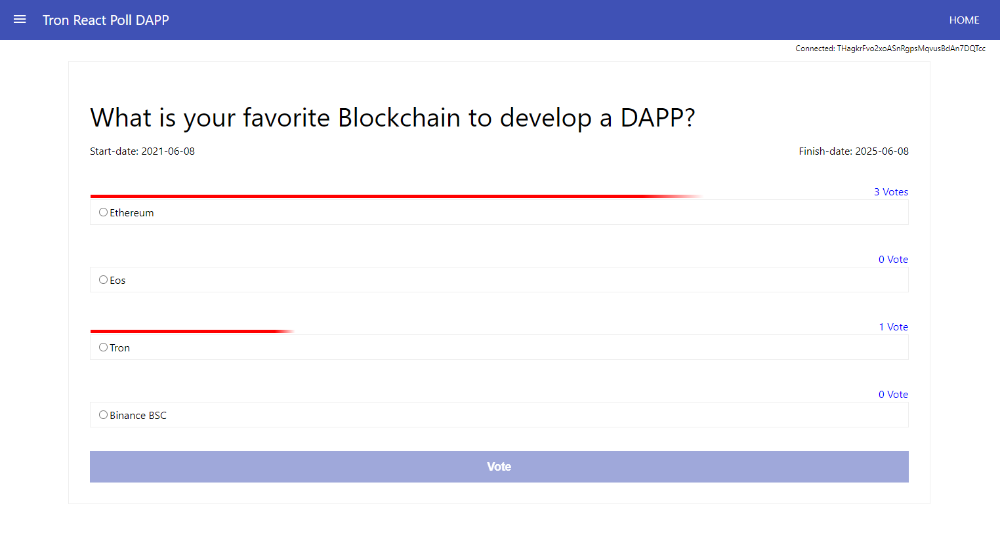

# Tron-React Poll DAPP
This is an open-source Poll DAPP (Decentralized application) on the Tron blockchain. We defined a TRC20 token in this project and use it as a vote-reward (16000 TPT-token as voting-reward for each poll)


## Packages

- **[docker-tron-quickstart](https://github.com/TRON-US/docker-tron-quickstart)**
- **[Tronbox](https://github.com/tronprotocol/tronbox)**
- **[Tronweb](https://github.com/tronprotocol/tronweb)**
- **[React](https://github.com/facebook/react)**
- **[Redux](https://github.com/reduxjs/redux)**
- **[React Router Dom](https://github.com/ReactTraining/react-router/tree/master/packages/react-router-dom)**
- **[Styled Components](https://github.com/styled-components/styled-components)**


## Start a local Tron node

```shell
docker run -it -p 9090:9090 --rm -v $PWD\tronbox\:/tron/tronbox -v $PWD/accounts-data:/config trontools/quickstart

```
or
```shell
docker run -it -p 9090:9090 --rm -v $PWD\tronbox\:/tron/tronbox -e "mnemonic=sunny butter catalog penalty merge soap wave priority victory prevent hollow remind" trontools/quickstart

```

### Some useful local endpoints:
- **[List on accounts](http://localhost:9090/admin/accounts)**

- **[Get details of a transaction](http://127.0.0.1:9090/wallet/gettransactionbyid?value=the-transaction-id)**


## Compile and Deploy Smart contracts

create a .env file in the tronbox folder and add your real private-keys in the .env file


```shell
cd tronbox && cp sample-env .env 
```

Deploy on the local net

```shell
cd tronbox && source .env && tronbox migrate --reset 

```
Deploy on the Shasta test net
```shell
cd tronbox && source .env && tronbox migrate --reset --network shasta

```
### Save contract addresses in the javascript file
`tronPollDappContract` and `tronPollTokenContract` in `src/tronServices/constants.js` should get replaced with your contract addresses.
### Set token address 
- Call `setToken` method in the poll contract and save the token address in the poll contract
- Allow the poll contract to spend tokens (by calling the `approve` method)
## Prerequisites
```
npm install
```


## Start DAPP
```
npm run start
```

## Demo
[url to demo page](https://vahidfzm.github.io/tron-react-poll-dapp/)

Screenshot of the voting page


PS: The demo-contract is published on Shasta network (a test network in tron blockchain) and to use it, you need to switch to shasta-node in the Tronlink wallet. 

